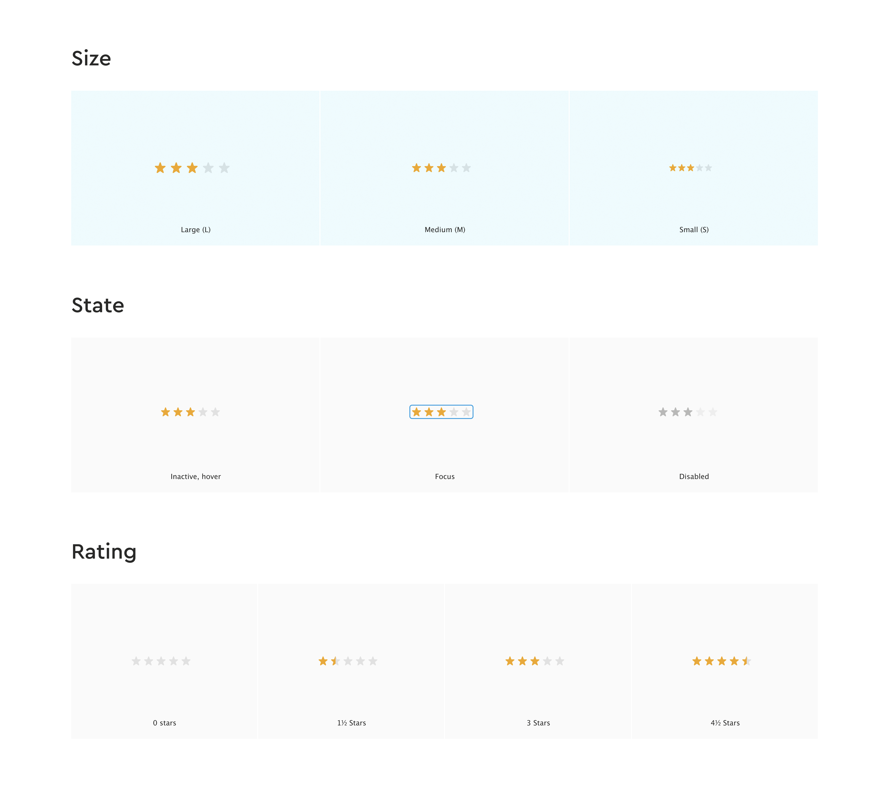
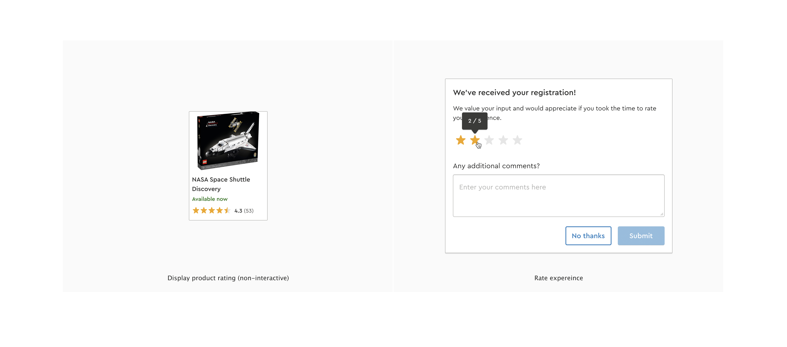

# We need a rating component!

Imagine you're a developer on the design systems team and you're being tasked with creating a new star rating component. 
The designs below are provided to you by the UX designer, along with the following technical requirements:

The UI component must be:
- accessible
- tested (unit tests)
- documented
- functional in all major browsers (latest version) — i.e. Edge, Chrome, Firefox and Safari Desktop/Mobile

## Constraints for the solution

- You must utilize web-components. Our recommendation is to use LIT (https://lit.dev/). 
    - The included boilerplate is using Lit, but feel free to use any other framework to solve the case.
- All code and files must be uploaded to a private GitHub repository on your account and made accessible only to the provided user.
- We recommend using CSS variables for the star color.

## Delivery expectations

- Accessibility has been prioritized.
- Keyboard and mouse support is available.
- An oral presentation of the functional solution of no more than 20 minutes.
    - Include an explanation about decisions, reflections and possible limitations of the solution.

## What we are looking for

- Code structure and readability
- Solid domain knowledge of web development
- Analytical skills and a prioritized approach to delivering the best possible outcome.
- Being able to work structured under time pressure
- Communication and presentation skills

## Contact

You can always reach out to your contact should you have any questions.